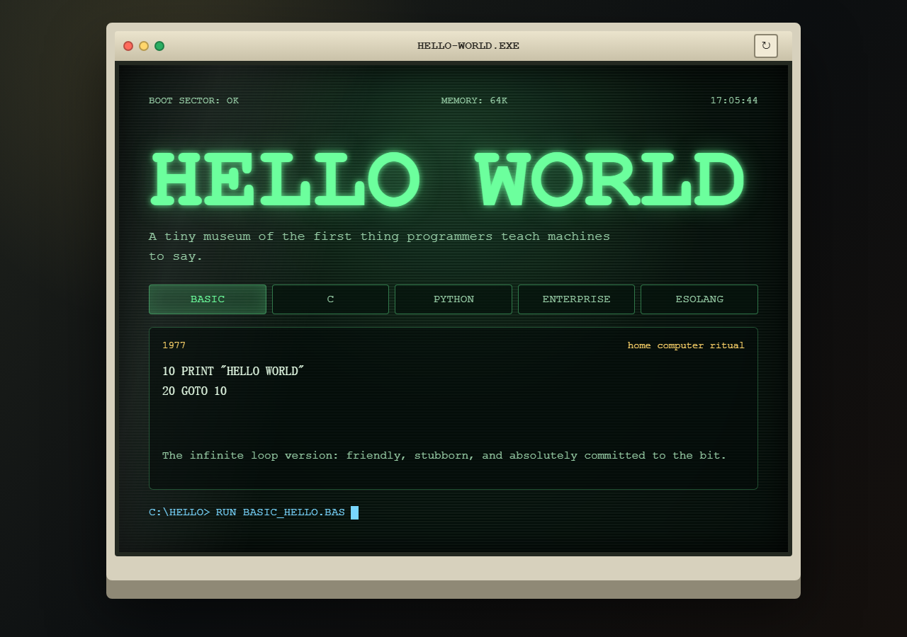

# hello-world.exe



**English** | [中文](#中文)

A retro CRT terminal museum for the oldest small program in the room.

`hello-world.exe` turns the classic "Hello, World!" into a tiny interactive exhibit: part old-school terminal, part science-fiction console, part joke about how much personality a first program can have.

[Live site](https://keioline.github.io/hello-world.exe/)

## Features

- CRT-inspired visual design with scanlines, glow, glass reflection, and a beige computer shell
- Five greeting modes: BASIC, C, Python, Enterprise, and Esolang
- Typewriter-style command prompt and a small reboot interaction
- No build step, no dependencies, no framework
- Works as a static GitHub Pages site

## Modes

| Mode | Mood | What it says |
| --- | --- | --- |
| BASIC | Home computer ritual | `10 PRINT "HELLO WORLD"` |
| C | Portable small spell | A canonical `puts("Hello, World!")` |
| Python | One-line clarity | `print("Hello, World!")` |
| Enterprise | Mission-critical greeting infrastructure | A wildly over-serious greeting API |
| Esolang | Beautifully unnecessary | A fictional three-command language |

## Run Locally

Open `index.html` directly in a browser, or serve the folder locally:

```bash
python -m http.server 4173
```

Then open:

```text
http://127.0.0.1:4173/
```

## Project Notes

- Design notes: [docs/design.md](docs/design.md)
- Mode guide: [docs/modes.md](docs/modes.md)
- Deployment notes: [docs/deployment.md](docs/deployment.md)

## Why

Because a Hello World repository does not have to be boring. It can be a little old school, a little theatrical, and still small enough to understand in one sitting.

---

## 中文

一个复古 CRT 终端风格的 Hello World 小博物馆。

`hello-world.exe` 把最经典的 "Hello, World!" 做成了一个小型互动展品：一点老式终端，一点科幻控制台，一点程序员式幽默。它不是为了复杂，而是为了把一个最简单的起点做得有记忆点。

[在线访问](https://keioline.github.io/hello-world.exe/)

## 特性

- CRT 风格视觉：扫描线、荧光字、屏幕反光、米色老电脑外壳
- 五种问候模式：BASIC、C、Python、Enterprise、Esolang
- 打字机式命令行提示和一个轻量重启交互
- 无构建步骤、无依赖、无框架
- 可以直接部署到 GitHub Pages

## 模式

| 模式 | 气质 | 内容 |
| --- | --- | --- |
| BASIC | 家用电脑仪式感 | `10 PRINT "HELLO WORLD"` |
| C | 经典小咒语 | 标准的 `puts("Hello, World!")` |
| Python | 一行清爽 | `print("Hello, World!")` |
| Enterprise | 任务关键型问候基础设施 | 一本正经但毫无必要的问候 API |
| Esolang | 美丽地多此一举 | 一个虚构的三命令语言 |

## 本地运行

可以直接用浏览器打开 `index.html`，也可以启动一个本地静态服务器：

```bash
python -m http.server 4173
```

然后访问：

```text
http://127.0.0.1:4173/
```

## 相关文档

- 设计说明：[docs/design.md](docs/design.md)
- 模式说明：[docs/modes.md](docs/modes.md)
- 部署说明：[docs/deployment.md](docs/deployment.md)

## 为什么做这个

因为 Hello World 仓库不一定非要无聊。它可以老派一点，戏剧化一点，也仍然小到可以一眼看懂。
